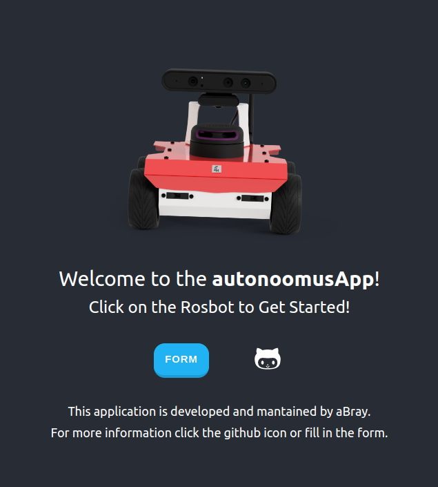
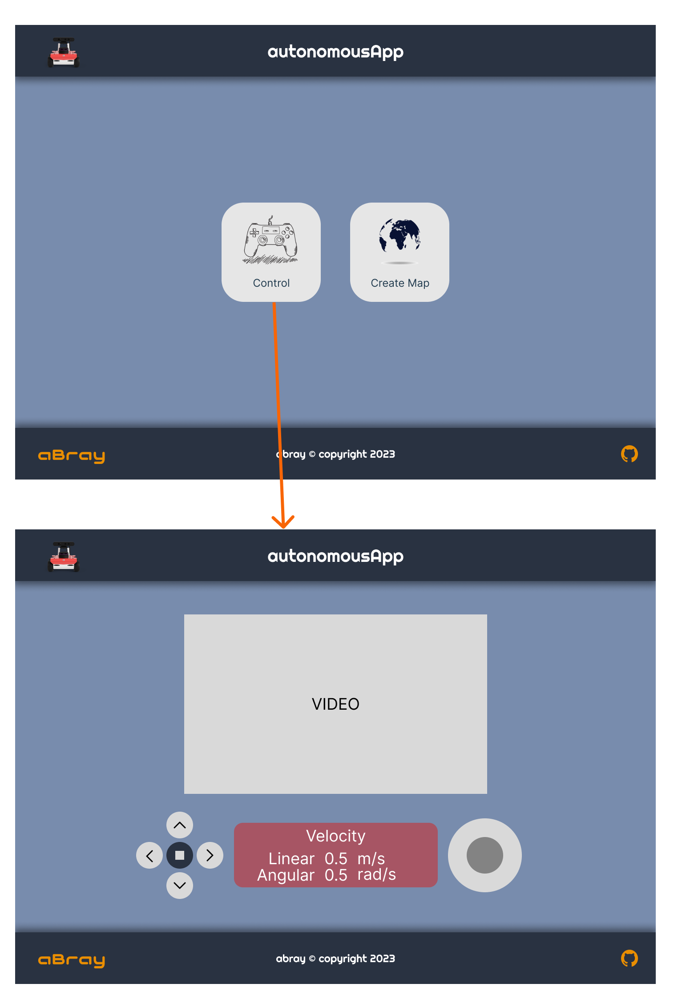

# autonomousApp
This ros application allows to interact with a simulation enviroment by means of a web application developed on a React framework in order to achieve some taks, such as:
- Move the robot around
- Build a map, manually or autonomoulsy, of unkown enviroments
- Enumerate rooms
- Informs the user about particular object detected

## Run Interface only
```
roslaunch rosbot_gui_bridge websocket.launch port:=9096
```



 